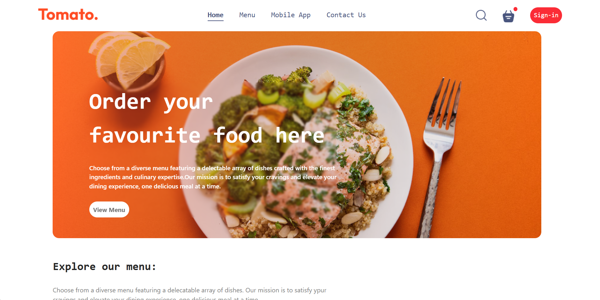
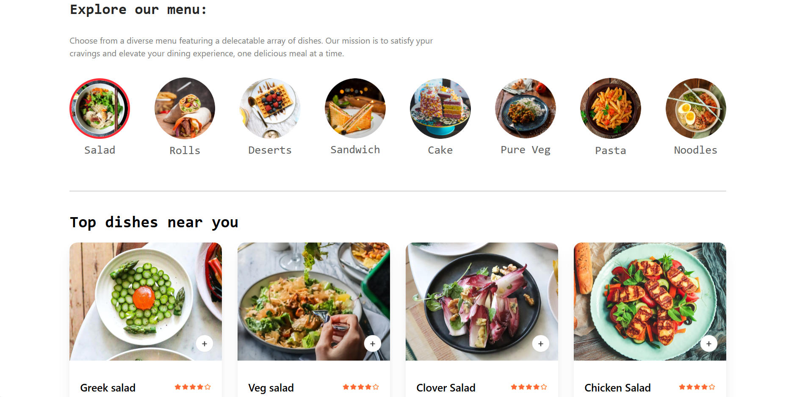
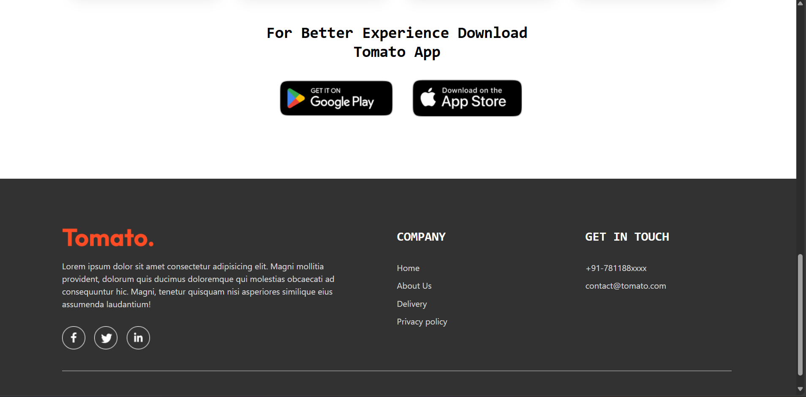

# Tomato Food Delivery (React + Vite)

An e-commerce food delivery web app built with React, Vite, and Tailwind CSS.

## Features
- Browse food menu by category
- Add/remove items to cart
- Place orders with delivery information
- Responsive design for desktop and mobile
- Promo code support
- Login popup
- About Us and Contact sections

## Getting Started
1. Clone the repo:
	```bash
	git clone https://github.com/xthunder91/react-tomato-food-delivery.git
	cd react-tomato-food-delivery
	```
2. Install dependencies:
	```bash
	npm install
	```
3. Start the development server:
	```bash
	npm run dev
	```

## Project Structure
- `src/` - React components, pages, context
- `public/` - Static assets and images
- `package.json` - Project config and scripts

## Screenshots

### Home Page


### Menu Section


### Cart & Checkout


## License
MIT
